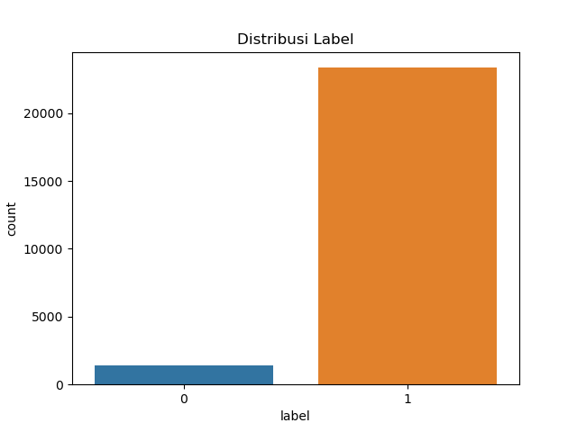
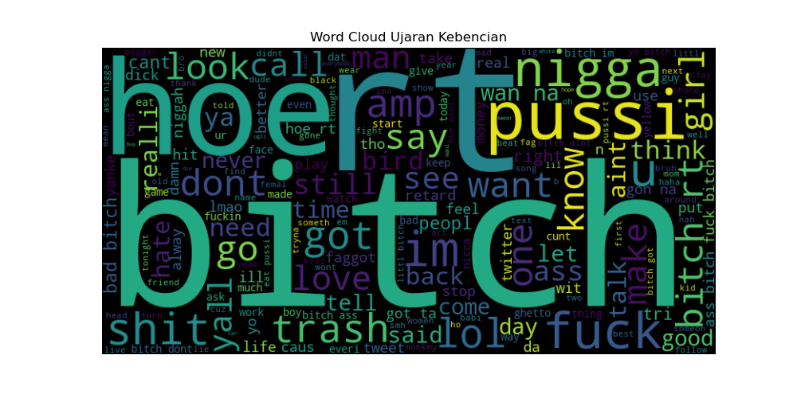

|       |                                   |
| ----- | --------------------------------- |
| Nama  | Yudi Fermana (312210321) |
| Kelas | TI.22.A.SE.1                      |
| Tugas | UTS Kecerdasan Buatan             |

# Dataset

Pilihan Dataset: Gunakan "Hate Speech and Offensive Language Dataset" dari Davidson et al. (tersedia di Kaggle atau GitHub: https://github.com/t-davidson/hate-speech-and-offensive-language). Alternatif, gunakan "ID Hate Speech Dataset" dari IndoBERT (tersedia di Hugging Face atau sumber lokal Indonesia: https://huggingface.co/datasets/indolem/indolem-hate-speech). Dataset ini memiliki minimal dua label: 0 (tidak mengandung ujaran kebencian) dan 1 (mengandung ujaran kebencian).

## Deskripsi Dataset:

Hate Speech and Offensive Language Dataset: Berisi tweet dalam bahasa Inggris dengan label 0 (tidak hate/offensive), 1 (offensive), dan 2 (hate speech). Untuk tugas ini, gabungkan label 1 dan 2 menjadi 1 (hate), dan 0 tetap 0.
ID Hate Speech Dataset: Dataset dalam bahasa Indonesia dengan label serupa (0 = bukan hate speech, 1 = hate speech).
Ukuran: Minimal 20.000 sampel untuk akurasi yang baik.
Cara Mendapatkan Dataset:
Unduh dari Kaggle (cari "Hate Speech and Offensive Language Dataset") atau GitHub.
Untuk ID dataset, gunakan Hugging Face: from datasets import load_dataset; dataset = load_dataset("indolem/indolem-hate-speech").
Simpan sebagai CSV atau load langsung ke Python. Pastikan kolom teks (misalnya 'tweet' atau 'text') dan label ('label').

# Preprocessing Teks

## Langkah-Langkah:

Case folding: Ubah semua teks ke huruf kecil.
Hapus tanda baca dan angka: Gunakan regex untuk membersihkan karakter non-alfabet.
Tokenisasi: Pecah teks menjadi kata-kata.
Stopword removal: Hapus kata-kata umum seperti "the", "is" (untuk Inggris) atau "dan", "yang" (untuk Indonesia).
Stemming/Lemmatization: Opsional, gunakan Porter Stemmer untuk Inggris atau Sastrawi untuk Indonesia.

```py
import pandas as pd
import re
import nltk
from nltk.corpus import stopwords
from nltk.tokenize import word_tokenize
from nltk.stem import PorterStemmer  # Untuk Inggris; ganti dengan Sastrawi untuk Indonesia

# Download NLTK resources jika belum ada
nltk.download('punkt')
nltk.download('stopwords')

# Load dataset (contoh: Hate Speech dataset)
df = pd.read_csv('hate_speech_dataset.csv')  # Ganti dengan path file Anda
df['text'] = df['tweet']  # Asumsikan kolom teks adalah 'tweet'
df['label'] = df['class'].apply(lambda x: 0 if x == 0 else 1)  # Gabungkan label

# Fungsi preprocessing
def preprocess_text(text):
    # Case folding
    text = text.lower()
    # Hapus tanda baca dan angka
    text = re.sub(r'[^a-zA-Z\s]', '', text)
    # Tokenisasi
    tokens = word_tokenize(text)
    # Stopword removal
    stop_words = set(stopwords.words('english'))  # Ganti 'english' dengan 'indonesian' jika dataset Indonesia
    tokens = [word for word in tokens if word not in stop_words]
    # Stemming (opsional)
    stemmer = PorterStemmer()
    tokens = [stemmer.stem(word) for word in tokens]
    return ' '.join(tokens)

# Terapkan preprocessing
df['cleaned_text'] = df['text'].apply(preprocess_text)
print(df.head())
```

Cara Menjalankan: Jalankan kode di Jupyter Notebook atau Python script. Pastikan library terinstall `pip install pandas nltk`. Output: Kolom baru 'cleaned_text' dengan teks yang sudah dibersihkan.

# Representasi Fitur

Pilihan Metode: Gunakan TF-IDF (rekomendasi untuk kesederhanaan) atau BoW. Alternatif: Embedding seperti Word2Vec (dengan Gensim).

## Langkah-Langkah:

Konversi teks ke vektor numerik.
Untuk TF-IDF: Hitung frekuensi kata dengan bobot invers dokumen.

```py
from sklearn.feature_extraction.text import TfidfVectorizer

# TF-IDF Vectorizer
vectorizer = TfidfVectorizer(max_features=5000)  # Maksimal 5000 fitur
X = vectorizer.fit_transform(df['cleaned_text'])
y = df['label']

print("Shape of X:", X.shape)  # Output: (jumlah sampel, jumlah fitur)
```

Cara Menjalankan: Jalankan setelah preprocessing. X adalah matriks fitur, y adalah label. Untuk BoW, ganti TfidfVectorizer dengan CountVectorizer dari sklearn.

# Pembangunan Model

Pilihan Algoritma: Gunakan Logistic Regression (sederhana dan efektif) atau SVM. Alternatif: LSTM dengan Keras untuk neural network.

## Langkah-Langkah:

Split data menjadi train dan test (80% train, 20% test).
Latih model.
Prediksi.

```py
from sklearn.model_selection import train_test_split
from sklearn.linear_model import LogisticRegression
from sklearn.metrics import classification_report

# Split data
X_train, X_test, y_train, y_test = train_test_split(X, y, test_size=0.2, random_state=42)

# Bangun model Logistic Regression
model = LogisticRegression()
model.fit(X_train, y_train)

# Prediksi
y_pred = model.predict(X_test)
print(classification_report(y_test, y_pred))
```

Cara Menjalankan: Jalankan setelah representasi fitur. Output: Laporan klasifikasi dengan precision, recall, dll. Untuk LSTM, gunakan TensorFlow/Keras dengan embedding layer.

# Evaluasi Model

Metrik: Confusion Matrix, Accuracy, Precision, Recall, F1-Score.

## Langkah-Langkah:

Hitung metrik dari prediksi.
Interpretasi: Accuracy tinggi menunjukkan model baik, tapi periksa F1 untuk imbalance data.

```py from sklearn.metrics import confusion_matrix, accuracy_score, precision_score, recall_score, f1_score

# Confusion Matrix
cm = confusion_matrix(y_test, y_pred)
print("Confusion Matrix:\n", cm)

# Metrik lainnya
accuracy = accuracy_score(y_test, y_pred)
precision = precision_score(y_test, y_pred)
recall = recall_score(y_test, y_pred)
f1 = f1_score(y_test, y_pred)

print(f"Accuracy: {accuracy:.2f}")
print(f"Precision: {precision:.2f}")
print(f"Recall: {recall:.2f}")
print(f"F1-Score: {f1:.2f}")

# Interpretasi: Jika F1 > 0.8, model baik; jika recall rendah, model miss hate speech.
```

Cara Menjalankan: Jalankan setelah model training. Visualisasikan confusion matrix dengan seaborn jika perlu.

# Visualisasi dan Laporan

## Visualisasi:

Distribusi label: Bar chart.
Word cloud untuk hate speech.

```py
import matplotlib.pyplot as plt
from wordcloud import WordCloud
import seaborn as sns

# Distribusi label
sns.countplot(x='label', data=df)
plt.title('Distribusi Label')
plt.show()

# Word cloud untuk hate speech
hate_text = ' '.join(df[df['label'] == 1]['cleaned_text'])
wordcloud = WordCloud(width=800, height=400).generate(hate_text)
plt.figure(figsize=(10, 5))
plt.imshow(wordcloud, interpolation='bilinear')
plt.axis('off')
plt.show()
```

# Output



